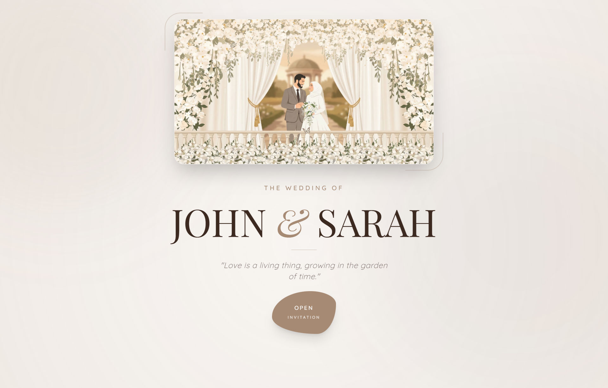

# Wedding Invitation - John & Sarah

A beautiful, responsive wedding invitation website built with HTML, Tailwind CSS, and JavaScript. This digital invitation allows couples to share their love story, event details, location, and receive RSVPs and guest messages.

## ✨ Features

- **Beautiful Design**: Elegant, modern, and fully responsive design that works on all devices.
- **Dark Mode**: Toggle between light and dark themes for comfortable viewing.
- **Dynamic Content**: All content is loaded from a JSON file, making it easy to customize.
- **Interactive Timeline**: Visual timeline of the couple's love story.
- **RSVP Form**: Guests can confirm their attendance.
- **Guestbook**: Visitors can leave messages and wishes.
- **Google Maps Integration**: Embedded map for easy navigation to the venue.
- **Mobile-Friendly**: Optimized for mobile devices with touch-friendly interactions.
- **Smooth Animations**: Scroll animations and hover effects enhance the user experience.

## 🛠️ Technologies Used

- **HTML5** - Structure and content
- **Tailwind CSS** - Utility-first CSS framework for styling
- **CSS3** - Custom animations and styles
- **JavaScript (ES6)** - Dynamic content loading and interactivity
- **Google Fonts** - Playfair Display, Lato, and other fonts
- **Material Icons** - Icon library

## 📁 Project Structure

wedding-invitation/
├── index.html # Landing page (open invitation)
├── invitation.html # Main invitation page
├── css/
│ ├── index.css # Styles for landing page
│ └── invitation.css # Styles for invitation page
├── js/
│ ├── index.js # Script for landing page
│ └── invitation.js # Script for invitation page
├── data/
│ └── data.json # All content data (names, dates, events, etc.)
├── assets/
│ └── images/ # All images (couple, backgrounds, etc.)
└── README.md # This file